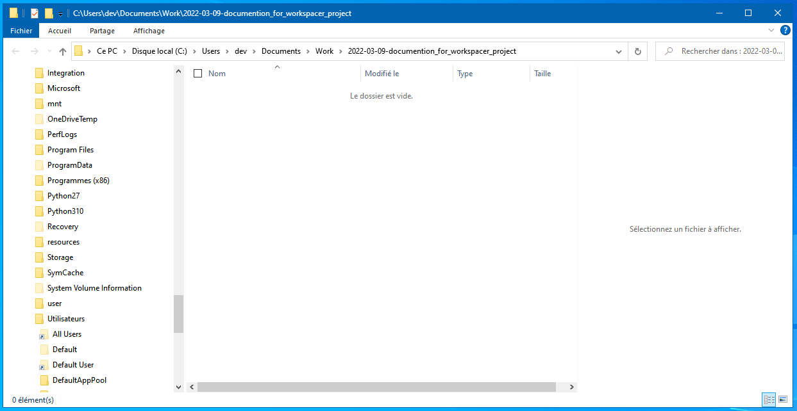
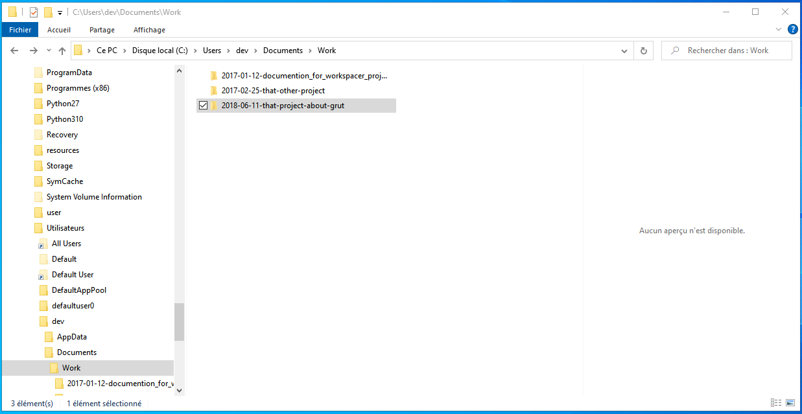
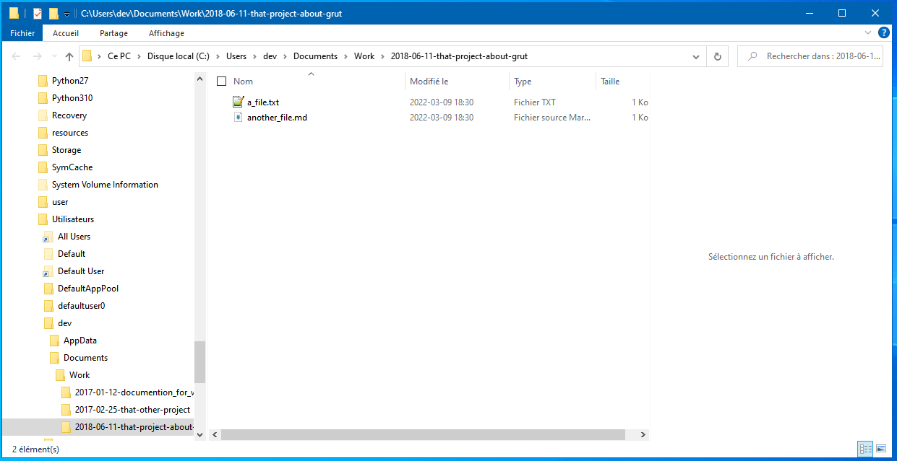
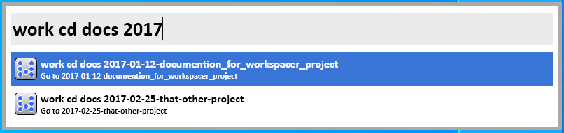
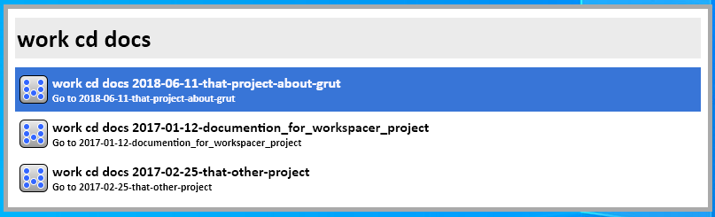

# BarLauncher-Workspacer

A tool to handle "workspaces", which are directories to work on a certain subject.

* Home: https://github.com/gissehel/BarLauncher-Workspacer
* Keyword : `work`

# To install in Wox

```
wpm install Workspacer
```

# To install in Flow Launcher

Waiting for acceptance...

# Documentation

Do you often find your self doing a task that require downloading some files, creating some other files, and the folder you work in is full of other files that has nothing to do with that ?

Perhaps you create a directory, and put all the files inside that directory.

And then you got a lot of directories you don't really remember what they were created for, and when you created them.

Workspacer is a tool to help you keep you files clean.

## name : give a name to a new repository

First, let's create a repository. A repository, is just the folder where all your workspaces will be.

Let's take `c:\Users\dev\Documents\Work` as a folder. We must name that repository. Let's name it `docs`

```
work name docs c:\Users\dev\Documents\Work
```


Now, you have one repository named `docs` where you can start to work.

Note that workspacer has now create you that repository if it didn't already exists.

## create : create a new workspace

Let's create a first workspace inside that repo. After `work create docs` just put a meaningfull title, with enought keyword to find it with those keywords.


```
work create docs Documention for Workspacer project
```


Note that workspacer has now create you a new folder `C:\Users\dev\Documents\Work\2017-01-12-documention_for_workspacer_project`
(2017-01-12 beeing the current date) and opened you an explorer in that folder.



## cd : go to an existing workspace

Now you've been using Workspacer for a while and have several projects:
- 2017-01-12-documention_for_workspacer_project
- 2017-02-25-that-other-project
- 2018-06-11-that-project-about-grut



Now you need to open again you workspace about grut

```
work cd docs grut
```


When you validate, it will open the folder `C:\Users\dev\Documents\Work\2018-06-11-that-project-about-grut`



You can also find a workspace by filtering the date part

```
work cd docs 2017
```


## archive : archive a workspace

Let's suppose you don't work anymore on a project. You don't want to delete the workspace, but you don't want either to have it when you search workspaces.

You can then archive the workspace.

Let's suppose, we want to archive the workspace `2017-02-25-that-other-project`

```
work cd docs
```




```
work archive docs other
```


When we validate that choice, it will move the workspace inside a subfolder `0__ARCHIVE__` and open the directory `C:\Users\dev\Documents\Work\0__ARCHIVE__\2017-02-25-that-other-project`.

## config : configure a new directory opener

By default, workspaces (and repo) are opened using explorer. You can configure the tool to use to open directories (under Wox, as Flow Launcher let's you configure that at Flow Launcher's level, Workspacer use the Flow Launcher directory opener)

To configure workspacer to use Total Commander (for example), type:

```
work config
```


It will show you all properties you can configure. Currently only `OpenDirCommand` is configurable.

Select that choice. You'll now have that:

```
work config OpenDirCommand 
```


This is the configuration you want to change, select again to change

```
work config OpenDirCommand="%1"
```


Now change that to have:

```
work config OpenDirCommand="c:\totalcmd\TOTALCMD64.EXE" /t /l="%1"
```


And validate.

Now everyworkspace will open in Total Commander.

## list : list all your repositories

```
work list
```


With `list` you can list all your repo, see where they are, and go to them if you validate the repository.

## Usages

You can use that tool to help you organise with all the file you download/create.

If you use it for work and home, you can create several repo, one for work, one for home etc.

You can also create some repo inside cloud folders like Dropbox/One Drive/Teams drives/etc. and have your workspace's repositories shared among several computers.


 
